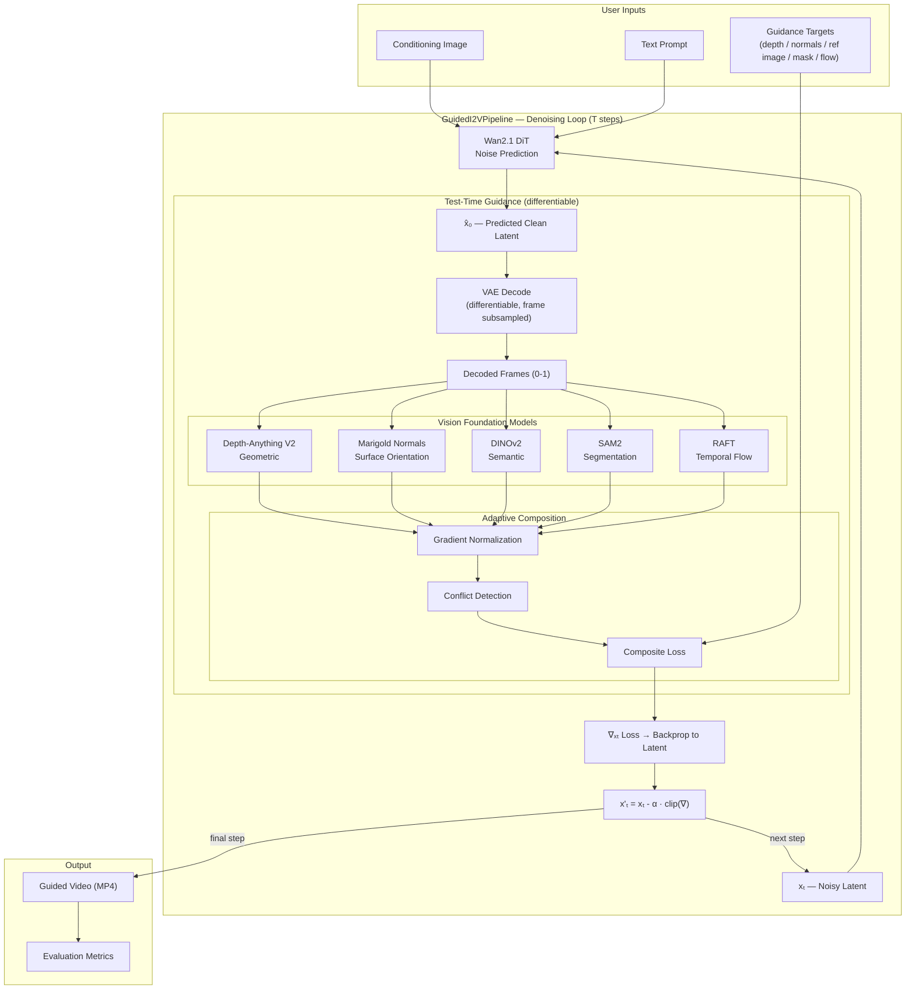

# Parallax — Composable Test-Time Guidance for I2V Diffusion

**Training-free controllable Image-to-Video generation** using vision foundation models as gradient-based steering signals at inference time.

## Core Idea

Instead of training a ControlNet for each control type, we compose **multiple pre-trained vision encoders** to guide the diffusion model's denoising process at test time:

```
At each denoising step t:
  1. DiT predicts denoised latent x̂₀
  2. VAE decodes x̂₀ → estimated frames (differentiably)
  3. Vision models extract features:
     • Depth-Anything V2 → depth guidance
     • Marigold Normals → surface normal guidance [NEW]
     • DINOv2 → semantic structure guidance
     • SAM2 → segmentation/spatial guidance
     • RAFT → optical flow consistency [NEW]
  4. Loss = Σ αᵢ · Lᵢ(vision_model(frame), target)
  5. Gradient ∂loss/∂xₜ → update latent
```

## Key Contributions

1. **5 composable guidance signals** — depth, normals, semantic, segmentation, optical flow — all at test time with zero training
2. **Surface normal guidance for video** — first application of normal-based control to video diffusion
3. **Optical flow temporal consistency** — cross-frame flow loss that reduces temporal flickering
4. **Adaptive gradient-normalized composition** — principled multi-signal weighting with conflict detection

## Quick Start

```bash
# Install
pip install -e ".[all]"

# Depth-guided generation
python scripts/run_guided_i2v.py \
  --image input.png \
  --prompt "A cat walking across a table" \
  --guidance depth \
  --target-depth target_depth.png \
  --output output.mp4

# Normal-guided generation (novel)
python scripts/run_guided_i2v.py \
  --image input.png \
  --prompt "A marble sculpture rotating" \
  --guidance normal \
  --target-normal normal_map.png \
  --output output.mp4

# Multi-guidance with adaptive composition
python scripts/run_guided_i2v.py \
  --image input.png \
  --prompt "A room interior" \
  --guidance depth+normal+semantic+flow \
  --adaptive \
  --target-depth depth.png \
  --target-normal normal.png \
  --reference-image ref.png \
  --output output.mp4

# With evaluation metrics
python scripts/run_guided_i2v.py \
  --image input.png \
  --prompt "A street scene" \
  --guidance depth+flow \
  --target-depth depth.png \
  --evaluate \
  --output output.mp4
```

## Architecture



### Project Structure

```
src/parallax/
├── pipeline.py                  # GuidedI2VPipeline (core denoising loop)
├── guidance/
│   ├── base.py                  # Abstract GuidanceModule
│   ├── depth.py                 # Depth-Anything V2 guidance
│   ├── normal.py                # Marigold Normals guidance [NEW]
│   ├── semantic.py              # DINOv2 guidance
│   ├── segmentation.py          # SAM2 guidance
│   ├── flow.py                  # RAFT optical flow guidance [NEW]
│   ├── composite.py             # Static multi-guidance combiner
│   └── adaptive_composite.py    # Adaptive gradient-normalized combiner [NEW]
├── evaluation/
│   └── metrics.py               # Control-specific eval metrics [NEW]
└── utils/
    ├── latent_utils.py          # Differentiable VAE decode, gradient tools
    └── visualization.py         # Video export, comparisons, overlays
```

## Guidance Modules

| Module | Vision Model | Signal | Loss | HuggingFace ID |
|--------|-------------|--------|------|----------------|
| `DepthGuidance` | Depth-Anything V2 | Monocular depth | MSE | `depth-anything/Depth-Anything-V2-Small-hf` |
| `NormalGuidance` | Depth-to-Normal (Sobel) | Surface normals | Cosine angular error | via depth model |
| `SemanticGuidance` | DINOv2 | Dense features | Cosine similarity | `facebook/dinov2-small` |
| `SegmentationGuidance` | SAM2 | Object masks | BCE / Dice | `facebook/sam2-hiera-small` |
| `FlowGuidance` | RAFT | Optical flow | EPE / Warp error | `torchvision` |

## Adaptive Composition

When using multiple guidance signals, `AdaptiveCompositeGuidance` provides:

1. **Gradient normalization** — each module's gradient is scaled to unit norm before combining, preventing any single signal from dominating
2. **Conflict detection** — when two signals produce opposing gradients (cosine similarity < threshold), the lower-weight signal is reduced
3. **Temporal scheduling** — different signals activate at different denoising phases

```bash
# Enable adaptive composition with --adaptive flag
python scripts/run_guided_i2v.py \
  --guidance depth+normal+semantic \
  --adaptive \
  ...
```

## Evaluation

Built-in evaluation metrics for controllable video generation:

| Metric | What It Measures |
|--------|-----------------|
| Depth RMSE / AbsRel | Depth accuracy vs target |
| Normal Angular Error | Surface normal accuracy |
| DINOv2 Cosine Sim | Semantic consistency |
| Warp Error | Temporal consistency (flow-based) |
| CLIP Score | Text-video alignment |

```bash
# Add --evaluate to any generation command
python scripts/run_guided_i2v.py --evaluate ...
# Saves metrics JSON alongside the output video
```

## Configuration

See `configs/*.yaml` for example configurations:
- `depth_guidance.yaml` — single depth signal
- `normal_guidance.yaml` — surface normal guidance
- `flow_guidance.yaml` — temporal flow consistency
- `adaptive_composite.yaml` — full multi-signal adaptive composition

## Testing

```bash
# Unit tests (no GPU needed)
python -m pytest tests/ -v

# With GPU (for full integration tests)
python -m pytest tests/ -v --gpu
```

## References

- [Universal Guidance for Diffusion Models](https://arxiv.org/abs/2302.07121) (Bansal et al., ICLR 2024)
- [TITAN-Guide](https://arxiv.org/abs/2508.00289) (Simon et al., ICCV 2025)
- [Wan2.1](https://github.com/Wan-Video/Wan2.1) — Base I2V model
- [Depth-Anything V2](https://huggingface.co/depth-anything/Depth-Anything-V2-Small-hf)
- [Marigold Normals](https://huggingface.co/prs-eth/marigold-normals-v1-1)
- [DINOv2](https://huggingface.co/facebook/dinov2-small)
- [SAM2](https://github.com/facebookresearch/segment-anything-2)
- [RAFT](https://arxiv.org/abs/2003.12039) — Optical flow estimation

## License

Apache 2.0
