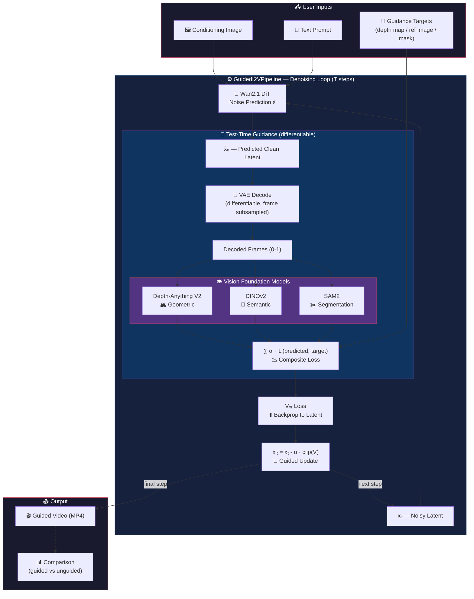

# Parallax — Zero-Shot Controllable I2V via Test-Time Guidance

**Training-free controllable Image-to-Video generation** using vision foundation models as gradient-based steering signals at inference time.

## Core Idea

Instead of training a ControlNet for each control type, we use **pre-trained vision encoders** to guide the diffusion model's denoising process at test time:

```
At each denoising step t:
  1. DiT predicts denoised latent x̂₀
  2. VAE decodes x̂₀ → estimated frames (differentiably)
  3. Vision model extracts features:
     • Depth-Anything V2 → depth guidance
     • DINOv2 → semantic structure guidance
     • SAM2 → segmentation/spatial guidance
  4. Loss = ||vision_model(frame) - target||²
  5. Gradient ∂loss/∂xₜ → update latent
```

## Quick Start

```bash
# Install
pip install -e ".[all]"

# Depth-guided generation
python scripts/run_guided_i2v.py \
  --image input.png \
  --prompt "A cat walking across a table" \
  --guidance depth \
  --target-depth target_depth.png \
  --guidance-scale 50.0 \
  --output output.mp4

# Semantic guidance (match reference layout)
python scripts/run_guided_i2v.py \
  --image input.png \
  --prompt "A street scene" \
  --guidance semantic \
  --reference-image reference.png \
  --output output.mp4

# Multi-guidance (depth + semantic)
python scripts/run_guided_i2v.py \
  --image input.png \
  --prompt "A room interior" \
  --guidance depth+semantic \
  --target-depth depth.png \
  --reference-image ref.png \
  --output output.mp4
```

## Architecture



### Project Structure

```
src/parallax/
├── pipeline.py           # GuidedI2VPipeline (core denoising loop)
├── guidance/
│   ├── base.py           # Abstract GuidanceModule
│   ├── depth.py          # Depth-Anything V2 guidance
│   ├── semantic.py       # DINOv2 guidance
│   ├── segmentation.py   # SAM2 guidance
│   └── composite.py      # Multi-guidance combiner
└── utils/
    ├── latent_utils.py   # Differentiable VAE decode, gradient tools
    └── visualization.py  # Video export, comparisons, overlays
```

## Key Design Decisions

- **Base model**: Wan2.1-I2V (Apache 2.0, diffusers-native)
- **Gradient flow**: Differentiable VAE decode → vision model → loss → backprop to latent
- **Memory**: Frame subsampling, gradient clipping, guidance scheduling (first 50% of steps)
- **Modularity**: Plug any vision model as a new `GuidanceModule` subclass

## Configuration

See `configs/*.yaml` for example configurations with tunable parameters.

## Testing

```bash
# Unit tests (no GPU needed)
python -m pytest tests/ -v

# With GPU (for full integration tests)
python -m pytest tests/ -v --gpu
```

## References

- [Universal Guidance for Diffusion Models](https://arxiv.org/abs/2302.07121) (Bansal et al., ICLR 2024)
- [Wan2.1](https://github.com/Wan-Video/Wan2.1) — Base I2V model
- [Depth-Anything V2](https://huggingface.co/depth-anything/Depth-Anything-V2-Small-hf)
- [DINOv2](https://huggingface.co/facebook/dinov2-small)
- [SAM2](https://github.com/facebookresearch/segment-anything-2)

## License

Apache 2.0
